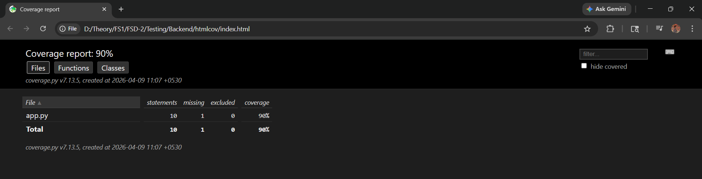
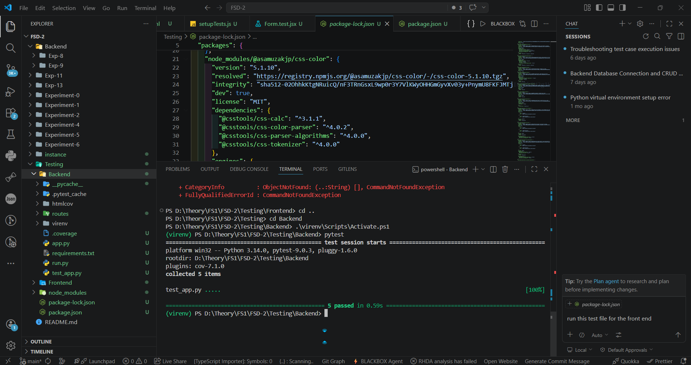
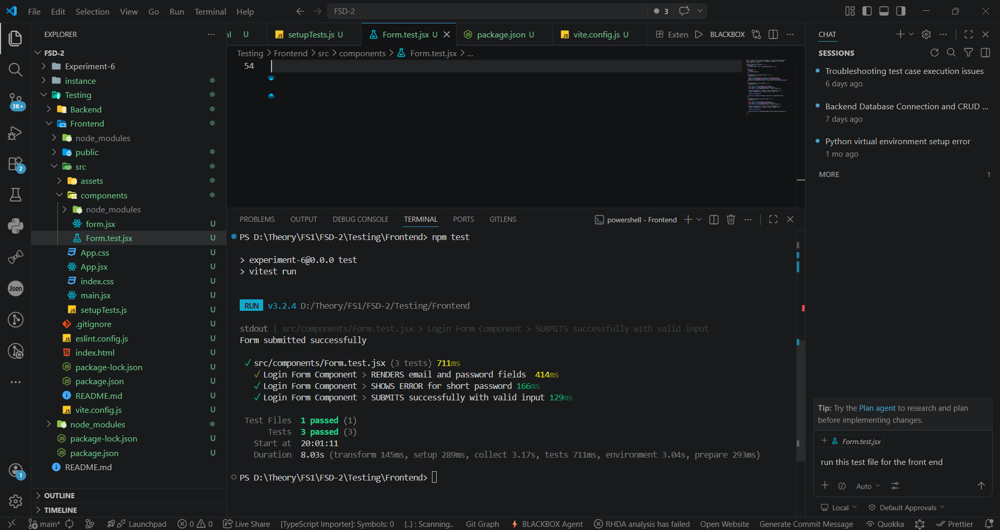
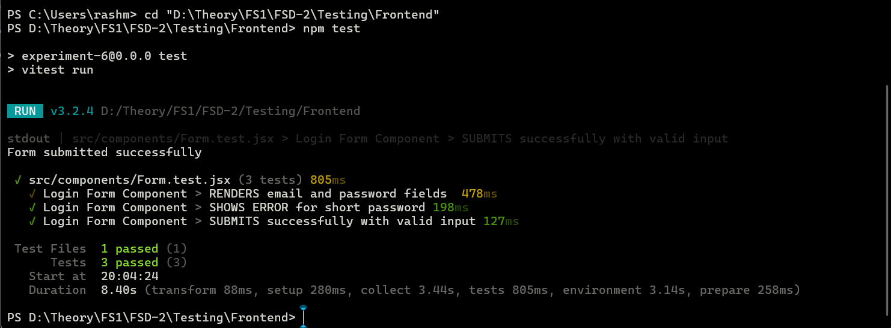

# Testing Module README

This folder contains the backend and frontend testing setup for the project.

## Folder Structure

- `Backend` contains the Flask backend application and `pytest` test cases.
- `Frontend` contains the React frontend application and `Vitest` component tests.

## Backend Work

The backend testing setup includes:

- a Flask app created in `Backend/app.py`
- student CRUD API routes in `Backend/routes/student_routes.py`
- automated API tests in `Backend/test_app.py`

### Backend Test Coverage

- create student
- get all students
- get student by id
- update student
- delete student

### Run Backend Tests

```bash
cd Testing/Backend
python -m venv venv
venv\Scripts\activate
pip install -r requirements.txt
pytest
```

## Frontend Work

The frontend testing setup includes:

- a React login form in `Frontend/src/components/form.jsx`
- validation for email and password fields
- component tests in `Frontend/src/components/Form.test.jsx`
- Vitest configuration in `Frontend/vite.config.js`

### Frontend Test Coverage

- checks that the form fields and login button render
- checks validation for short passwords
- checks successful submission with valid input

### Run Frontend Tests

```bash
cd Testing/Frontend
npm ci
npm test
```

## CI Workflow

The GitHub Actions workflow is configured in `.github/workflows/ci.yml`.

### CI Changes Applied

- Node version updated to `20` for frontend tests
- frontend dependency install changed to `npm ci`
- unstable Vitest inline dependency config removed
- malformed `Testing/package.json` fixed
- frontend dependency resolution stabilized with `overrides`

## Workflow Screenshots

### Backend Coverage Report



### Backend Pytest Output



### Frontend Vitest Output



### Frontend Terminal Run



## Expected Outcome

- backend tests pass with `pytest`
- frontend tests pass with `vitest`
- CI runs both testing jobs successfully
